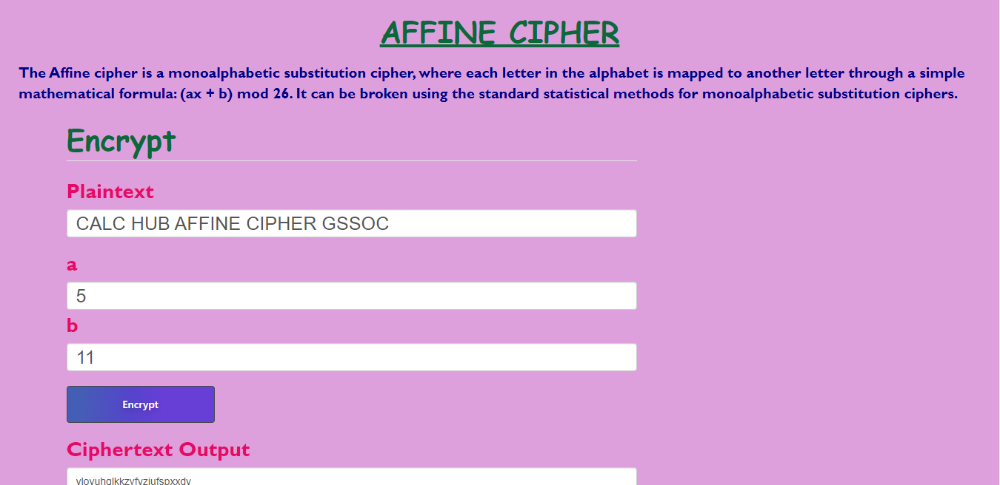
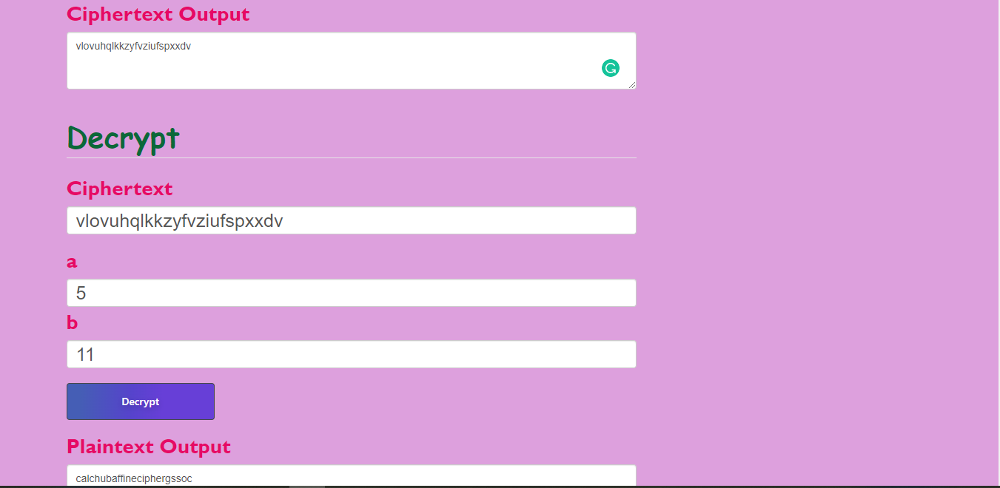
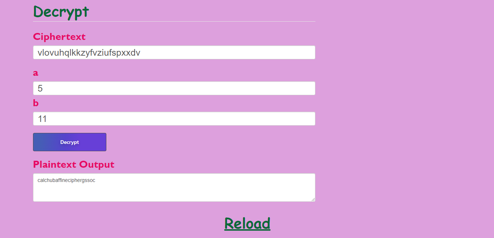

## AFFINE CIPHER

The Affine cipher is a type of monoalphabetic substitution cipher, wherein each letter in an alphabet is mapped to its numeric equivalent, encrypted using a simple mathematical function, and converted back to a letter. The formula used means that each letter encrypts to one other letter, and back again, meaning the cipher is essentially a standard substitution cipher with a rule governing which letter goes to which. 
The whole process relies on working modulo m (the length of the alphabet used). In the affine cipher, the letters of an alphabet of size m are first mapped to the integers in the range 0 … m-1. 

The ‘key’ for the Affine cipher consists of 2 numbers, we’ll call them a and b. The following discussion assumes the use of a 26 character alphabet (m = 26). a should be chosen to be relatively prime to m (i.e. a should have no factors in common with m). 

## SCREENSHOTS OF THE CALCULATOR

## TO RUN

Just use the index.html file and style.css to run the code, and get your calculator working.