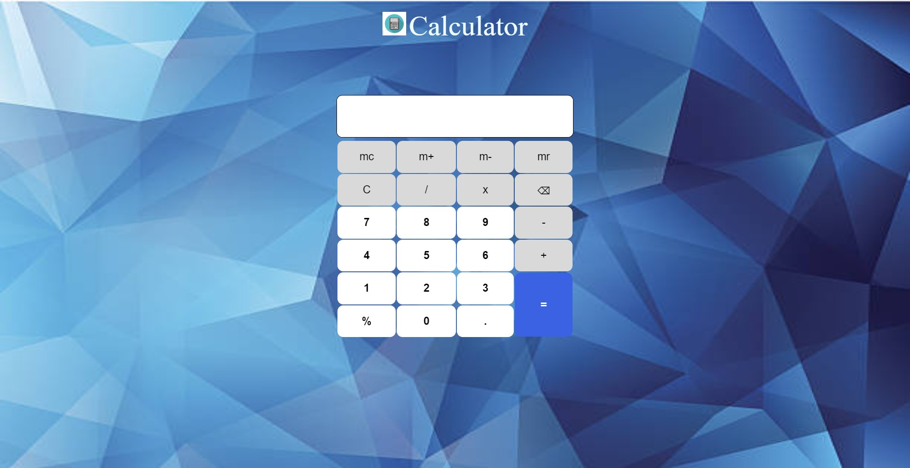

# Simple Arithmetic Calculator

### Functionalities :-

- Addition
- Subtraction
- Division
- Multiplication
- Percentage Calculation
- Memory Add
- Memory Substract
- Memory Recall
- Memory Clear

### Built With :-

- HTML5, CSS3, JavaScript

### ScreenShot :-

