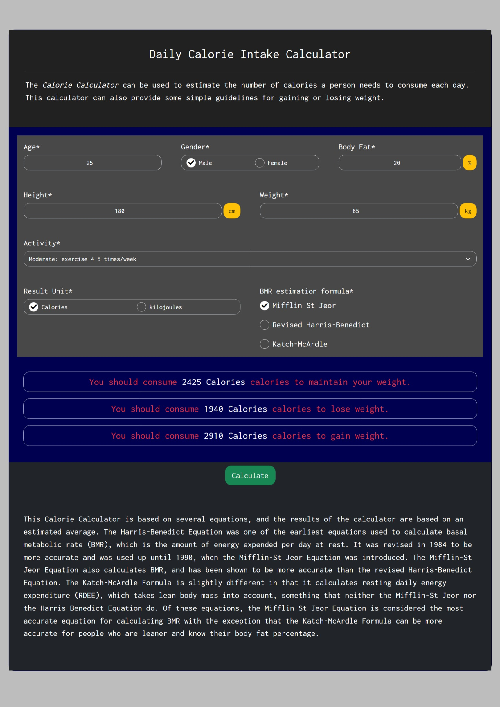

# Daily Calorie Intake Calculator
The Calorie Calculator can be used to estimate the number of calories a person needs to consume each day. You have to input your age, sex, height, weight and bodyfat (for Katch McArdle formula) and it will tell you the number of calories you should consume to lose weight, gain weight and maintain your current weight.

