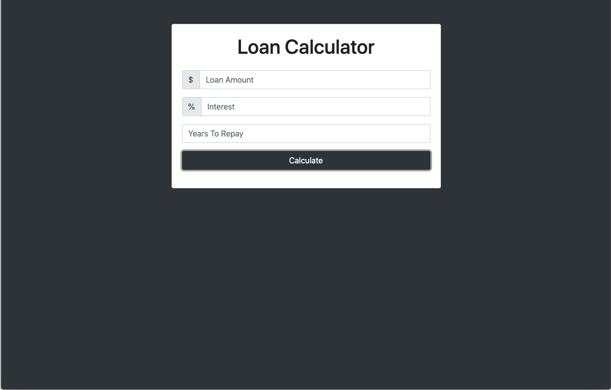
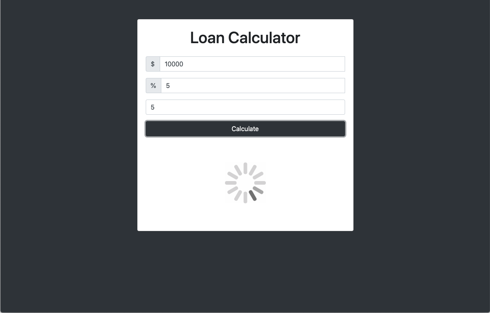
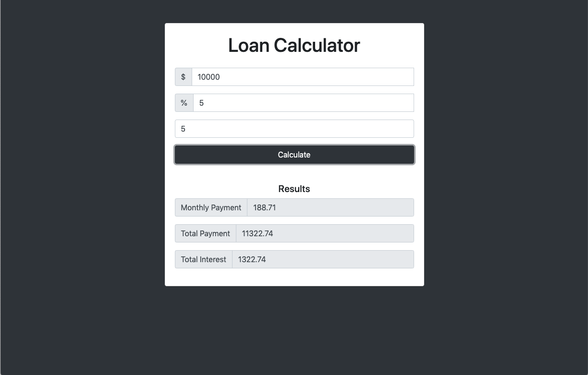
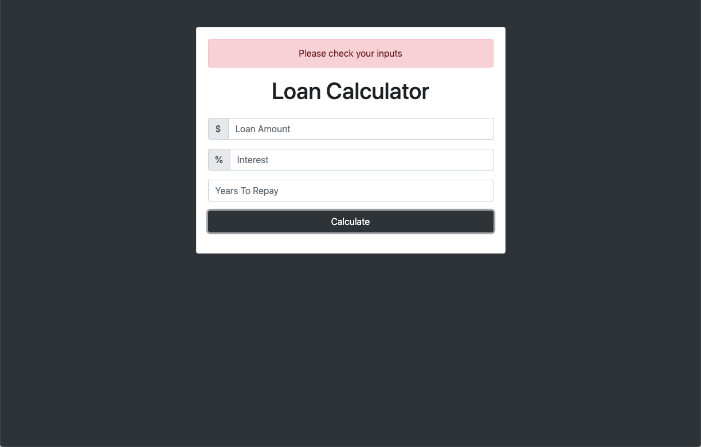

<h1 align="center">Loan Calculator</h1>

A loan calculator built with JavaScript

## Table of Contents
* [Project Status](#project-status)
* [Features](#features)
* [Screenshots](#screenshots)
* [Technologies](#technologies)
* [Inspirations](#inspirations)
* [Contact](#contact)
* [License](#license)

## Project Status
This project is currently: _Complete_

## Features
Complete:
* Users can enter a loan amount, interest rate, and years to repay
* Loading animation displays upon submission
* Calculates and displays the results for monthly payment, total payment, and total interest
* An error message displays if the input is invalid

## Screenshots

## Technologies
Built with:
* HTML
* CSS
* JavaScript

## Inspirations
This project was built as part of Brad Traversy's Udemy course, [Modern JavaScript from the Beginning](https://www.udemy.com/modern-javascript-from-the-beginning/).

## Contact
Twitter - [@CBStanley12](https://twitter.com/CBStanley12)

DEV - [cbstanley12](https://dev.to/cbstanley12)

## License
**MIT License**: 
A short and simple permissive license with conditions only requiring preservation of copyright and license notices. Licensed works, modifications, and larger works may be distributed under different terms and without source code.